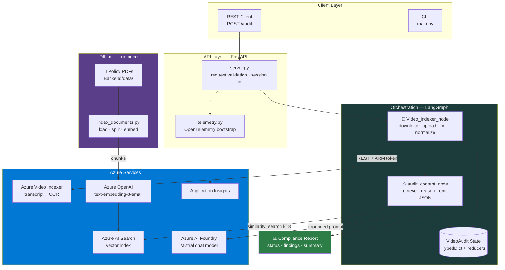
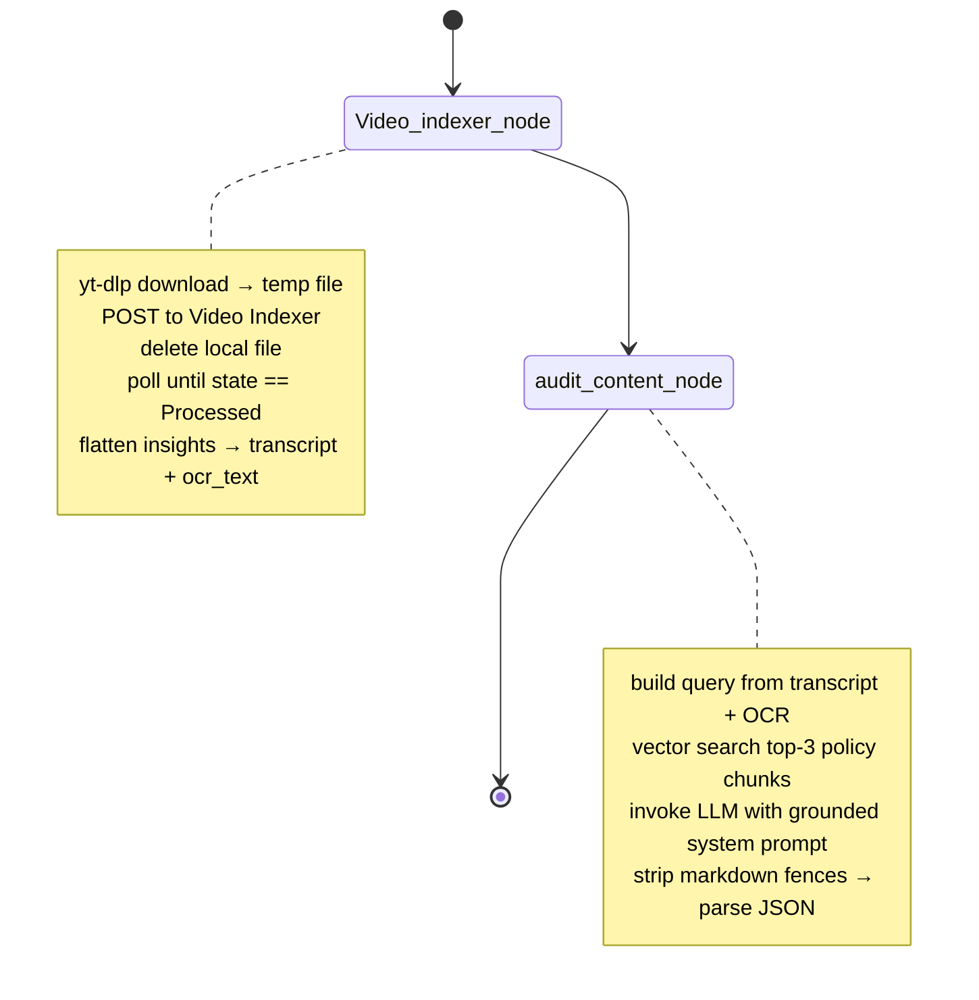

<div align="center">

# 🎬 AdAudit — Video Ad Compliance Agent

**An LLMOps pipeline that watches your video ads and tells you what will get them taken down.**

Give it a YouTube URL. It downloads the video, extracts the spoken transcript and the on-screen text, retrieves the advertising policies that actually apply, and returns a structured compliance verdict — before your ad ever reaches a review queue.

[](https://www.python.org/)
[](https://langchain-ai.github.io/langgraph/)
[](https://fastapi.tiangolo.com/)
[](https://ai.azure.com/)
[](https://github.com/astral-sh/uv)
[](LICENSE)
[](#-project-status)

[Overview](#-overview) • [Architecture](#-architecture) • [Quickstart](#-quickstart) • [API](#-api-reference) • [Configuration](#-configuration) • [Roadmap](#-roadmap) • [Contributing](#-contributing)

</div>

---

## 📖 Table of Contents

- [Overview](#-overview)
- [Why this exists](#-why-this-exists)
- [Features](#-features)
- [Architecture](#-architecture)
  - [System diagram](#system-diagram)
  - [The agent graph](#the-agent-graph)
  - [Repository layout](#repository-layout)
- [Tech stack](#-tech-stack)
- [Quickstart](#-quickstart)
  - [Prerequisites](#prerequisites)
  - [1. Provision Azure resources](#1-provision-azure-resources)
  - [2. Clone and install](#2-clone-and-install)
  - [3. Configure environment](#3-configure-environment)
  - [4. Build the knowledge base](#4-build-the-knowledge-base)
  - [5. Run an audit](#5-run-an-audit)
- [Usage](#-usage)
- [API reference](#-api-reference)
- [Configuration](#-configuration)
- [Knowledge base](#-knowledge-base)
- [Observability](#-observability)
- [Deployment](#-deployment)
- [Project status](#-project-status)
- [Known limitations](#-known-limitations)
- [Roadmap](#-roadmap)
- [Contributing](#-contributing)
- [Security](#-security)
- [License](#-license)
- [Acknowledgements](#-acknowledgements)

---

## 🔍 Overview

**AdAudit** is a stateful AI agent that performs automated compliance review of video advertisements.

Modern ad platforms reject creatives for reasons that are buried in hundred-page policy PDFs — unsubstantiated health claims, missing `#ad` disclosures, prohibited superlatives, unreadable legal disclaimers, restricted product categories. Finding those problems by hand costs a reviewer 20–40 minutes per asset, and the reviewer still has to remember which of six overlapping rulebooks applies.

This project turns that review into a repeatable pipeline:

```
YouTube URL  →  multimodal extraction  →  policy retrieval  →  LLM audit  →  structured verdict
```

The output is not prose. It is a machine-readable report — a `PASS`/`FAIL` status and a list of typed violations with category, severity, and a written justification grounded in the retrieved policy text — so it can gate a CI pipeline, block a publish step, or open a ticket automatically.

### What makes it multimodal

A transcript alone misses half of what an ad says. A disclaimer that appears as 8px grey text in the last 400ms of a spot is invisible to a speech-to-text model but is exactly the thing a regulator cares about. AdAudit reads **both** channels:

| Channel | Source | Catches |
|---------|--------|---------|
| 🗣️ **Transcript** | Azure Video Indexer speech-to-text | Spoken claims, testimonials, undisclosed endorsements |
| 👁️ **OCR** | Azure Video Indexer on-screen text extraction | Fine-print disclaimers, superimposed pricing, burned-in captions, logos |
| 📊 **Metadata** | Video Indexer insights summary | Duration limits, aspect/platform constraints |

---

## 💡 Why this exists

This repository is also an **LLMOps reference implementation**. It deliberately shows the parts of an LLM system that tutorials skip:

- **Graph-based orchestration** instead of a chain of `if` statements, so failure at any node is a first-class state transition rather than an exception that kills the run.
- **Typed, reducer-backed state** — errors and compliance findings *accumulate* across nodes via `operator.add` instead of overwriting each other.
- **Grounded generation** — the model is never asked "is this ad compliant?" from memory. It is handed the top-*k* retrieved policy passages and asked to judge against them.
- **Structured output contracts** — the LLM must return JSON matching a fixed schema, with markdown-fence stripping and a fail-closed default (`FAIL`) when parsing breaks.
- **Production telemetry from day one** — distributed traces, latency, and token metrics to Azure Monitor; prompt-level traces to LangSmith.

---

## ✨ Features

| | Feature | Description |
|---|---------|-------------|
| 🎥 | **Zero-upload ingestion** | Point it at a YouTube URL. `yt-dlp` fetches the media to a scratch file, which is deleted the moment it reaches Azure. |
| 🧠 | **Multimodal understanding** | Speech transcript **and** OCR of on-screen text via Azure Video Indexer's indexing pipeline. |
| 📚 | **RAG-grounded verdicts** | Policy PDFs (FTC influencer guidance, YouTube ad specs, your own brand book) are chunked, embedded, and retrieved per-audit from Azure AI Search. |
| 🕸️ | **LangGraph state machine** | Explicit nodes and edges with a typed `TypedDict` state; trivially extensible with new checks. |
| 📋 | **Structured JSON reports** | Every finding carries `category`, `severity`, and `description`. Fail-closed on malformed model output. |
| 🔐 | **Keyless Azure auth** | `DefaultAzureCredential` → ARM token → Video Indexer account token. No stored VI secrets. |
| 🚀 | **Production API** | FastAPI service with Pydantic request/response models, a health probe, and auto-generated OpenAPI docs. |
| 📈 | **Full observability** | OpenTelemetry → Azure Application Insights, plus LangSmith tracing for prompt-level debugging. |
| ⚡ | **Reproducible envs** | `uv` + a committed lockfile. Same dependency graph on every machine. |

---

## 🏛 Architecture

### System diagram



### The agent graph

The workflow is a linear `StateGraph` compiled at import time in [`workflow.py`](Backend/src/graph/workflow.py):



**State schema** — [`state.py`](Backend/src/graph/state.py)

```python
class VideoAudit(TypedDict):
    # ── input ────────────────────────────────
    video_url: str
    video_id: str

    # ── extraction ───────────────────────────
    video_file_path: Optional[str]
    metadata: Dict[str, Any]
    transcript: Optional[str]
    ocr_text: List[str]

    # ── analysis (accumulating) ──────────────
    compliance_result: Annotated[List[ComplianceIssue], operator.add]

    # ── output ───────────────────────────────
    final_status: str   # "PASS" | "FAIL"
    final_report: str

    # ── errors (accumulating) ────────────────
    error: Annotated[List[str], operator.add]
```

The `Annotated[..., operator.add]` reducers matter: when a node returns a partial state dict, LangGraph *appends* to these lists rather than replacing them. Every node can contribute findings and errors without clobbering what came before.

### Repository layout

```
Video_Summarizer_for_ads_llmops/
│
├── Backend/
│   ├── data/                          # 📄 Policy corpus (PDF)
│   │   ├── 1001a-influencer-guide-508_1.pdf   # FTC endorsement guides
│   │   └── youtube-ad-specs.pdf               # Platform ad specifications
│   │
│   ├── scripts/
│   │   └── index_documents.py         # 🔧 Offline ETL → vector store
│   │
│   └── src/
│       ├── api/
│       │   ├── server.py              # 🚀 FastAPI app, routes, schemas
│       │   └── telemetry.py           # 📈 Azure Monitor / OTel setup
│       │
│       ├── graph/
│       │   ├── state.py               # 📐 VideoAudit TypedDict + reducers
│       │   ├── nodes.py               # 🧩 Node implementations
│       │   └── workflow.py            # 🕸️ StateGraph wiring + compile
│       │
│       └── services/
│           └── video_indexer.py       # ☁️ Azure Video Indexer client
│
├── main.py                            # 🖥️ CLI entrypoint
├── nodes.drawio                       # 🎨 Editable architecture diagram
├── pyproject.toml                     # 📦 Project metadata + deps
├── uv.lock                            # 🔒 Resolved dependency lockfile
├── .python-version                    # 🐍 3.12
└── .env                               # 🔑 Secrets (gitignored)
```

---

## 🛠 Tech stack

| Layer | Technology | Role |
|-------|-----------|------|
| **Orchestration** | [LangGraph](https://langchain-ai.github.io/langgraph/) `1.2+` | Stateful multi-step agent graph |
| **LLM framework** | [LangChain](https://python.langchain.com/) `1.3+` | Prompt templates, message types, document abstractions |
| **Reasoning model** | Mistral via [Azure AI Foundry](https://ai.azure.com/) | Compliance judgement, `temperature=0.0` for determinism |
| **Embeddings** | Azure OpenAI `text-embedding-3-small` | 1536-dim vectors for policy chunks |
| **Vector store** | [Azure AI Search](https://learn.microsoft.com/azure/search/) | Hybrid/vector similarity retrieval |
| **Video AI** | [Azure Video Indexer](https://learn.microsoft.com/azure/azure-video-indexer/) | Transcription, OCR, scene insights |
| **Media ingest** | [`yt-dlp`](https://github.com/yt-dlp/yt-dlp) | YouTube download to temp file |
| **PDF parsing** | [`pypdf`](https://pypdf.readthedocs.io/) + `RecursiveCharacterTextSplitter` | 1000-char chunks, 200-char overlap |
| **API** | [FastAPI](https://fastapi.tiangolo.com/) + Pydantic | Typed HTTP surface, OpenAPI docs |
| **Auth** | `azure-identity` `DefaultAzureCredential` | Keyless ARM → VI token exchange |
| **Telemetry** | `azure-monitor-opentelemetry` + LangSmith | Traces, metrics, prompt debugging |
| **Packaging** | [`uv`](https://github.com/astral-sh/uv) | Fast resolver, reproducible lockfile |

---

## 🚀 Quickstart

### Prerequisites

| Requirement | Version | Notes |
|-------------|---------|-------|
| Python | `>= 3.12` | Pinned in `.python-version` |
| [`uv`](https://docs.astral.sh/uv/getting-started/installation/) | latest | `pip install uv` or `winget install astral-sh.uv` |
| [Azure CLI](https://learn.microsoft.com/cli/azure/install-azure-cli) | latest | Needed for `DefaultAzureCredential` local login |
| [FFmpeg](https://ffmpeg.org/download.html) | latest | Required by `yt-dlp` for muxing |
| Azure subscription | — | With quota for the services below |

### 1. Provision Azure resources

You need five Azure resources. Create them in the same region where possible to minimise egress latency.

<details>
<summary><b>📋 Click for Azure CLI provisioning commands</b></summary>

```bash
# ── Variables ────────────────────────────────────────────
RG="rg-adaudit"
LOC="eastus"
az group create --name $RG --location $LOC

# ── 1. Azure AI Search (vector store) ────────────────────
az search service create \
  --name adaudit-search --resource-group $RG \
  --sku basic --location $LOC

# ── 2. Azure AI Foundry / OpenAI (LLM + embeddings) ──────
az cognitiveservices account create \
  --name adaudit-aoai --resource-group $RG \
  --kind AIServices --sku S0 --location $LOC

az cognitiveservices account deployment create \
  --name adaudit-aoai --resource-group $RG \
  --deployment-name text-embedding-3-small \
  --model-name text-embedding-3-small \
  --model-version "1" --model-format OpenAI \
  --sku-capacity 10 --sku-name Standard

# ── 3. Storage (required by Video Indexer) ───────────────
az storage account create \
  --name adauditstorage --resource-group $RG \
  --location $LOC --sku Standard_LRS

# ── 4. Application Insights (telemetry) ──────────────────
az monitor app-insights component create \
  --app adaudit-insights --resource-group $RG --location $LOC

# ── 5. Video Indexer — create in the portal ──────────────
# https://portal.azure.com → Create → "Video Indexer"
# Attach the storage account above and enable a
# system-assigned managed identity.

# ── Grant yourself Contributor on the VI account ─────────
az role assignment create \
  --assignee $(az ad signed-in-user show --query id -o tsv) \
  --role "Contributor" \
  --scope "/subscriptions/<SUB_ID>/resourceGroups/$RG/providers/Microsoft.VideoIndexer/accounts/<VI_NAME>"
```

</details>

Then authenticate locally so `DefaultAzureCredential` can pick up your identity:

```bash
az login
```

### 2. Clone and install

```bash
git clone https://github.com/ArChIt690/Video_Summarizer_for_ads_llmops.git
cd Video_Summarizer_for_ads_llmops

# Creates .venv and installs the exact locked dependency set
uv sync
```

<details>
<summary>Prefer plain <code>pip</code>?</summary>

```bash
python -m venv .venv
source .venv/bin/activate        # Windows: .venv\Scripts\activate
pip install -e .
```

</details>

> **Note** — `yt-dlp` and `azure-identity` are imported by the runtime but not yet declared in `pyproject.toml`. Until that is fixed (see [Known limitations](#-known-limitations)), add them explicitly:
> ```bash
> uv add yt-dlp azure-identity python-dotenv uvicorn
> ```

### 3. Configure environment

Copy the template and fill in your values:

```bash
cp .env.example .env
```

```dotenv
# ── Azure AI Foundry — reasoning model ───────────────────
AZURE_MISTRAL_KEY=<your-key>
AZURE_MISTRAL_ENDPOINT=https://<resource>.services.ai.azure.com
AZURE_MISTRAL_VERSION=2024-05-01-preview
AZURE_MISTRAL_DEPLOYMENT=<your-mistral-deployment-name>

# ── Azure OpenAI — embeddings ────────────────────────────
AZURE_OPENAI_EMBEDDING_DEPLOYMENT=text-embedding-3-small

# ── Azure AI Search — vector store ───────────────────────
AZURE_SEARCH_ENDPOINT=https://<service>.search.windows.net
AZURE_SEARCH_API_KEY=<admin-key>
AZURE_SEARCH_INDEX_NAME=ad-compliance-index

# ── Azure Video Indexer ──────────────────────────────────
AZURE_VI_NAME=<vi-account-name>
AZURE_VI_LOCATION=<eastus|trial|...>
AZURE_VI_ACCOUNT_ID=<vi-account-guid>
AZURE_SUBSCRIPTION_ID=<subscription-guid>
AZURE_RESOURCE_GROUP=rg-adaudit
AZURE_STORAGE_CONNECTION_STRING=<storage-connection-string>

# ── Observability ────────────────────────────────────────
APPLICATIONINSIGHTS_CONNECTION_STRING=InstrumentationKey=...
LANGCHAIN_TRACING_V2=true
LANGCHAIN_ENDPOINT=https://api.smith.langchain.com
LANGCHAIN_API_KEY=<langsmith-key>
LANGCHAIN_PROJECT=video-ad-compliance
```

> ⚠️ **`.env` is gitignored and must stay that way.** Never commit real credentials. See [SECURITY.md](SECURITY.md).

### 4. Build the knowledge base

The agent cannot judge an ad without policies to judge it against. Drop your PDFs into `Backend/data/` and run the indexer **once**:

```bash
uv run python Backend/scripts/index_documents.py
```

```
════════════════════════════════════════════════════════════
AZURE_SEARCH_ENDPOINT = https://adaudit-search.search.windows.net
AZURE_SEARCH_INDEX_NAME = ad-compliance-index
════════════════════════════════════════════════════════════
INFO  successfully integrated the api keys of the embedded model
INFO  azure ai search configured with index: ad-compliance-index
INFO  taking the pdf one by one: 1001a-influencer-guide-508_1.pdf
INFO  splitted into 47 chunks
INFO  taking the pdf one by one: youtube-ad-specs.pdf
INFO  splitted into 112 chunks
INFO  storing 159 chunks in database
════════════════════════════════════════════════════════════
INFO  stored all the documents in the database in Azure
════════════════════════════════════════════════════════════
```

Re-run this whenever you add, remove, or update a policy document.

### 5. Run an audit

**CLI:**

```bash
uv run python main.py
```

**API server:**

```bash
uv run uvicorn Backend.src.api.server:app --reload --port 8000
```

Then open <http://localhost:8000/docs> for the interactive Swagger UI.

---

## 📘 Usage

### Via the REST API

```bash
curl -X POST http://localhost:8000/audit \
  -H "Content-Type: application/json" \
  -d '{"video_url": "https://www.youtube.com/watch?v=dQw4w9WgXcQ"}'
```

**Response — a failing ad:**

```json
{
  "video_id": "vid_a3f9c1e2",
  "session_id": "a3f9c1e2-7b44-4d18-9f30-11c8e6d5b2a7",
  "status": "FAIL",
  "compliance_results": [
    {
      "severity": "CRITICAL",
      "category": "Claim Validation",
      "description": "The narration states 'clinically proven to cure insomnia in 3 days' at 0:12. No substantiation or study citation appears in the transcript or on screen. FTC endorsement guidance requires competent and reliable scientific evidence for health-efficacy claims."
    },
    {
      "severity": "HIGH",
      "category": "Disclosure",
      "description": "The creator endorses the product without a clear and conspicuous material-connection disclosure. No '#ad', '#sponsored', or spoken disclosure was detected in either the transcript or the OCR text."
    },
    {
      "severity": "MEDIUM",
      "category": "Legibility",
      "description": "On-screen disclaimer 'Results may vary' is present in OCR output but appears only in the final 0.4 seconds, below the platform's minimum sustained-display threshold."
    }
  ],
  "final_report": "The advertisement fails compliance review. One critical unsubstantiated health claim, one missing material-connection disclosure, and one disclaimer legibility issue were identified. Remediation of the CRITICAL finding is required before publication."
}
```

**Response — a passing ad:**

```json
{
  "video_id": "vid_88b1d047",
  "session_id": "88b1d047-2c19-4a6e-8de1-9f2ab4c70e35",
  "status": "PASS",
  "compliance_results": [],
  "final_report": "No policy violations were identified. Claims are appropriately qualified, the sponsorship disclosure appears within the first 3 seconds in both audio and on-screen text, and all disclaimers meet legibility requirements."
}
```

### Via Python

```python
from Backend.src.graph.workflow import graph

result = graph.invoke({
    "video_url": "https://www.youtube.com/watch?v=<id>",
    "video_id": "vid_demo_001",
    "compliance_result": [],
    "error": [],
})

print(result["final_status"])   # "PASS" | "FAIL"
for issue in result["compliance_result"]:
    print(f"[{issue['severity']}] {issue['category']}: {issue['description']}")
```

### Severity taxonomy

| Severity | Meaning | Recommended action |
|----------|---------|--------------------|
| 🔴 `CRITICAL` | Legal or regulatory exposure — false claims, prohibited categories | Block publication |
| 🟠 `HIGH` | Platform policy violation likely to cause rejection | Fix before submission |
| 🟡 `MEDIUM` | Guideline deviation; risk of reduced reach or manual review | Fix in next revision |
| 🔵 `LOW` | Best-practice suggestion | Optional |

---

## 🔌 API reference

Base URL: `http://localhost:8000`

### `POST /audit`

Runs the full compliance workflow synchronously.

**Request body**

| Field | Type | Required | Description |
|-------|------|:--------:|-------------|
| `video_url` | `string` | ✅ | Public YouTube URL (`youtube.com` or `youtu.be`) |

**Response `200 OK`**

| Field | Type | Description |
|-------|------|-------------|
| `video_id` | `string` | Internal identifier, `vid_<8-hex>` |
| `session_id` | `string` | UUID4 correlation id — use this to find the trace in App Insights |
| `status` | `string` | `PASS` or `FAIL` |
| `compliance_results` | `array<ComplianceResult>` | Findings; empty on `PASS` |
| `final_report` | `string` | Human-readable summary |

**`ComplianceResult`**

| Field | Type | Description |
|-------|------|-------------|
| `severity` | `string` | `CRITICAL` \| `HIGH` \| `MEDIUM` \| `LOW` |
| `category` | `string` | e.g. `Claim Validation`, `Disclosure`, `Legibility` |
| `description` | `string` | Grounded justification for the finding |

**Errors**

| Code | Condition |
|------|-----------|
| `422` | Request body failed Pydantic validation |
| `500` | Workflow execution failed — download, Video Indexer, retrieval, or LLM error |

> ⏱️ **Latency warning:** this endpoint blocks for the duration of Video Indexer processing, typically **2–10 minutes** for a 30–60 second ad. Set generous client timeouts. An async job-queue variant is on the [roadmap](#-roadmap).

### `GET /health`

Liveness probe.

```json
{ "status": "healthy", "servies": "brand-video-compliance" }
```

### `GET /docs` · `GET /redoc` · `GET /openapi.json`

Auto-generated interactive documentation and machine-readable schema.

---

## ⚙️ Configuration

All configuration is environment-driven and loaded with `python-dotenv` (`override=True`).

| Variable | Required | Used by | Description |
|----------|:--------:|---------|-------------|
| `AZURE_MISTRAL_KEY` | ✅ | nodes, indexer | Azure AI Foundry API key |
| `AZURE_MISTRAL_ENDPOINT` | ✅ | indexer | Foundry resource endpoint |
| `AZURE_MISTRAL_VERSION` | ✅ | nodes, indexer | API version string |
| `AZURE_MISTRAL_DEPLOYMENT` | ✅ | nodes | Chat model deployment name |
| `AZURE_OPENAI_EMBEDDING_DEPLOYMENT` | ✅ | indexer | Defaults to `text-embedding-3-small` |
| `AZURE_SEARCH_ENDPOINT` | ✅ | nodes, indexer | AI Search service URL |
| `AZURE_SEARCH_API_KEY` | ✅ | nodes, indexer | Admin key (write) / query key (read) |
| `AZURE_SEARCH_INDEX_NAME` | ✅ | nodes, indexer | Vector index name |
| `AZURE_VI_NAME` | ✅ | video_indexer | Video Indexer account name |
| `AZURE_VI_LOCATION` | ✅ | video_indexer | VI region, e.g. `eastus` |
| `AZURE_VI_ACCOUNT_ID` | ✅ | video_indexer | VI account GUID |
| `AZURE_SUBSCRIPTION_ID` | ✅ | video_indexer | For the ARM token exchange |
| `AZURE_RESOURCE_GROUP` | ✅ | video_indexer | For the ARM token exchange |
| `AZURE_STORAGE_CONNECTION_STRING` | ➖ | — | Backing storage for VI |
| `APPLICATIONINSIGHTS_CONNECTION_STRING` | ➖ | telemetry | Enables Azure Monitor export |
| `LANGCHAIN_TRACING_V2` | ➖ | LangChain | `true` to enable LangSmith |
| `LANGCHAIN_ENDPOINT` | ➖ | LangChain | LangSmith API endpoint |
| `LANGCHAIN_API_KEY` | ➖ | LangChain | LangSmith key |
| `LANGCHAIN_PROJECT` | ➖ | LangChain | Trace grouping name |

### Tunable constants

| Setting | Location | Default | Effect |
|---------|----------|---------|--------|
| `chunk_size` | `index_documents.py` | `1000` | Policy chunk length in characters |
| `chunk_overlap` | `index_documents.py` | `200` | Context carried between chunks |
| `k` | `nodes.py` (`similarity_search`) | `3` | Policy passages injected per audit |
| `temperature` | `nodes.py` (LLM) | `0.0` | Determinism of the verdict |
| poll interval | `video_indexer.py` | `30s` | Video Indexer status backoff |
| `indexingPreset` | `video_indexer.py` | `Default` | VI insight depth vs. cost |

---

## 📚 Knowledge base

The retrieval corpus lives in [`Backend/data/`](Backend/data/) and ships with two starter documents:

| Document | Source | Covers |
|----------|--------|--------|
| `1001a-influencer-guide-508_1.pdf` | US Federal Trade Commission | Endorsement disclosure, material connections, "clear and conspicuous" standards |
| `youtube-ad-specs.pdf` | YouTube / Google Ads | Format specs, prohibited content, creative requirements |

### Adding your own policies

1. Drop any `.pdf` into `Backend/data/`.
2. Re-run `uv run python Backend/scripts/index_documents.py`.
3. New chunks are embedded and upserted into the same index, tagged with a `source` metadata field.

Good candidates: your brand style guide, ASA/CAP codes for the UK, regional pharma advertising rules, platform-specific policies for TikTok or Meta, and your legal team's internal claim-substantiation matrix.

**Ingestion pipeline:**

```
PDF → PyPDFLoader → RecursiveCharacterTextSplitter(1000/200)
    → text-embedding-3-small → Azure AI Search vector index
```

---

## 📈 Observability

### Azure Application Insights

[`telemetry.py`](Backend/src/api/telemetry.py) calls `configure_azure_monitor()` **before** the graph is imported, so LangChain and HTTP instrumentation attach to every downstream call. You get distributed traces across the FastAPI request, the Video Indexer polling loop, the vector search, and the LLM invocation — plus request counts, failure rates, and dependency latency.

Useful KQL once traces land:

```kusto
// Slowest audits in the last 24h
requests
| where name == "POST /audit"
| where timestamp > ago(24h)
| project timestamp, duration, success, operation_Id
| order by duration desc
| take 20
```

```kusto
// Failure breakdown by exception type
exceptions
| where timestamp > ago(7d)
| summarize count() by type, outerMessage
| order by count_ desc
```

### LangSmith

Set `LANGCHAIN_TRACING_V2=true` and every graph run appears in your LangSmith project with the full prompt, the retrieved policy chunks, the raw model completion, and token usage. This is the fastest way to debug a verdict you disagree with — you can see exactly which three policy passages the model was handed.

### Correlation

Every audit generates a `session_id` (UUID4) that is returned in the API response and prefixes the `video_id`. Use it to join a user-reported issue to its trace.

---

## 🚢 Deployment

### Docker

```dockerfile
FROM python:3.12-slim

RUN apt-get update && apt-get install -y --no-install-recommends \
        ffmpeg ca-certificates \
    && rm -rf /var/lib/apt/lists/*

COPY --from=ghcr.io/astral-sh/uv:latest /uv /usr/local/bin/uv

WORKDIR /app
COPY pyproject.toml uv.lock ./
RUN uv sync --frozen --no-dev

COPY . .

ENV PATH="/app/.venv/bin:$PATH"
EXPOSE 8000

HEALTHCHECK --interval=30s --timeout=5s --start-period=10s \
  CMD python -c "import urllib.request,sys; sys.exit(0 if urllib.request.urlopen('http://localhost:8000/health').status==200 else 1)"

CMD ["uvicorn", "Backend.src.api.server:app", "--host", "0.0.0.0", "--port", "8000"]
```

```bash
docker build -t adaudit:latest .
docker run -p 8000:8000 --env-file .env adaudit:latest
```

### Azure Container Apps

```bash
az containerapp up \
  --name adaudit \
  --resource-group rg-adaudit \
  --image <registry>.azurecr.io/adaudit:latest \
  --target-port 8000 --ingress external \
  --system-assigned \
  --env-vars-file .env
```

Enable the system-assigned managed identity and grant it **Contributor** on the Video Indexer account — `DefaultAzureCredential` then resolves it automatically with no secrets in the container.

### Production checklist

- [ ] Secrets in Azure Key Vault, not `--env-file`
- [ ] Managed identity for every Azure call that supports it
- [ ] Async job queue in front of `/audit` (see [roadmap](#-roadmap)) so requests don't hold connections for minutes
- [ ] Rate limiting and authentication on the public endpoint
- [ ] Autoscale rules sized to Video Indexer concurrency quota
- [ ] Alert rules on `exceptions` and P95 `duration`
- [ ] Scratch-file cleanup verified under failure (currently only on the happy path)

---

## 🧪 Project status

> **Alpha — under active development.** The architecture is settled; several modules still have known defects and the pipeline has not yet been run end-to-end against live Azure resources. It is a working reference for the design, not yet a dependable production service.

| Component | Status | Notes |
|-----------|:------:|-------|
| State schema (`state.py`) | 🟡 | `ComplianceIssue` subclasses `Annotated` instead of `TypedDict` |
| Graph wiring (`workflow.py`) | 🟡 | Nodes registered by name but edges reference function objects |
| Video Indexer client | 🟡 | `get_account_token` URL is built as a tuple; `wait_for_extract` never returns |
| Audit node | 🟡 | Calls `AzureSearch.similarity_search` on the class, not the instance |
| Document indexer | 🟡 | `index_name` referenced before assignment; upsert runs inside the per-PDF loop |
| FastAPI server | 🟡 | `request = AuditRequest` should be a type annotation; reads `status` where state writes `final_status` |
| CLI (`main.py`) | 🟡 | Imports `Workflow`, which the module does not export |
| Telemetry | 🟢 | Functional |
| Packaging | 🟡 | `yt-dlp`, `azure-identity`, `python-dotenv`, `uvicorn` missing from deps |
| Tests | 🔴 | None yet |
| CI | 🔴 | None yet |

Contributions that close any of these are very welcome — see [Contributing](#-contributing).

---

## ⚠️ Known limitations

**Functional**

- **YouTube only.** Direct file upload, blob URLs, and other platforms are not supported.
- **Synchronous and slow.** `/audit` blocks for the full Video Indexer processing time (2–10 min). There is no job queue, no polling endpoint, and no webhook.
- **No caching.** Auditing the same URL twice re-downloads, re-uploads, and re-indexes it, paying the full cost each time.
- **English-centric prompts.** Video Indexer supports many languages, but the audit prompt and the policy corpus assume English.
- **Fixed `k=3` retrieval.** Long ads that touch several policy areas may not retrieve every relevant rule.
- **No human-in-the-loop.** Verdicts are final; there is no review, override, or feedback-capture step.

**Operational**

- The scratch `.mp4` is deleted only on the success path — a crash between download and upload leaves it on disk.
- Uploaded videos are never deleted from the Video Indexer account, so storage grows without bound.
- The polling loop has no maximum-wait guard and will spin indefinitely if the service stalls.
- Rate limits and quota exhaustion on Azure services are not retried with backoff.

**Advisory scope**

> ⚖️ **This tool does not provide legal advice.** It is a pre-screening aid that surfaces likely policy problems. Automated compliance review has false positives and false negatives. Do not use it as the sole gate before publishing regulated advertising. Have qualified counsel review anything with legal exposure.

---

## 🗺 Roadmap

**v0.2 — Make it work**
- [ ] Fix the defects listed in [Project status](#-project-status)
- [ ] Declare all runtime dependencies in `pyproject.toml`
- [ ] Convert `ComplianceIssue` to a proper `TypedDict` / Pydantic model
- [ ] End-to-end run verified against live Azure resources

**v0.3 — Make it right**
- [ ] `pytest` suite with mocked Azure clients; ≥80% coverage on graph nodes
- [ ] GitHub Actions CI: `ruff`, `mypy`, `pytest` on every PR
- [ ] Structured output via LangChain `with_structured_output()` instead of regex fence-stripping
- [ ] Retry with exponential backoff on all Azure calls
- [ ] Maximum-wait guard and `finally`-block cleanup for temp files

**v0.4 — Make it fast**
- [ ] Async job queue (Celery or Azure Service Bus) with `POST /audit` → `202` + `GET /audit/{id}`
- [ ] Webhook callbacks on completion
- [ ] Result caching keyed on video content hash
- [ ] Video Indexer asset cleanup after extraction

**v0.5 — Make it better**
- [ ] Frame-level visual analysis via a vision model, beyond OCR
- [ ] Multi-platform policy packs (TikTok, Meta, LinkedIn) with per-platform routing
- [ ] Conditional graph edges — skip the audit node when extraction yields nothing
- [ ] Human-in-the-loop review node with LangGraph interrupts
- [ ] Golden-dataset evaluation harness and regression scoring in CI
- [ ] Web dashboard for submitting audits and browsing history

---

## 🤝 Contributing

Contributions are welcome — bug fixes, policy packs, tests, and documentation especially.

```bash
# 1. Fork, then clone your fork
git clone https://github.com/<you>/Video_Summarizer_for_ads_llmops.git
cd Video_Summarizer_for_ads_llmops

# 2. Install with dev extras
uv sync

# 3. Branch
git checkout -b feat/conditional-edges

# 4. Make your change, then verify
uv run ruff check .
uv run pytest            # once tests exist

# 5. Commit and open a PR
git commit -m "feat(graph): add conditional edge for empty extraction"
git push origin feat/conditional-edges
```

**Conventions**

- Commit messages follow [Conventional Commits](https://www.conventionalcommits.org/): `feat:`, `fix:`, `docs:`, `refactor:`, `test:`, `chore:`.
- New graph nodes go in `Backend/src/graph/nodes.py` and are wired in `workflow.py`.
- New external integrations go in `Backend/src/services/` as a class with a narrow public surface.
- Every node must return a partial state dict and must never raise past its own `try/except` — failures belong in the `error` list.
- Never commit `.env`, credentials, or downloaded media.

Full details in [CONTRIBUTING.md](CONTRIBUTING.md). By participating you agree to the [Code of Conduct](CODE_OF_CONDUCT.md).

---

## 🔐 Security

- Video Indexer access uses `DefaultAzureCredential` → ARM token → short-lived account token. **No Video Indexer secret is ever stored.**
- Downloaded media is written to a local scratch file and deleted after upload.
- All keys are read from the environment. `.env` is gitignored.
- Uploads are created with `privacy: "Private"`.

Found a vulnerability? **Do not open a public issue.** See [SECURITY.md](SECURITY.md) for private disclosure instructions.

---

## 📄 License

Released under the [MIT License](LICENSE). © 2026 Archit Chakraborty.

The bundled policy PDFs in `Backend/data/` are the property of their respective publishers (US FTC, Google/YouTube) and are included for demonstration under their own terms.

---

## 🙏 Acknowledgements

- [LangChain](https://github.com/langchain-ai/langchain) and [LangGraph](https://github.com/langchain-ai/langgraph) — agent orchestration
- [Azure AI Video Indexer](https://learn.microsoft.com/azure/azure-video-indexer/) — multimodal media insights
- [yt-dlp](https://github.com/yt-dlp/yt-dlp) — media ingestion
- [FastAPI](https://github.com/fastapi/fastapi) — the API layer
- [uv](https://github.com/astral-sh/uv) — dependency management
- The [US FTC](https://www.ftc.gov/) endorsement guides, which make up the seed policy corpus

---

<div align="center">

**Built by [Archit Chakraborty](https://github.com/ArChIt690)**

If this project is useful to you, consider leaving a ⭐

[Report a bug](https://github.com/ArChIt690/Video_Summarizer_for_ads_llmops/issues/new?labels=bug) · [Request a feature](https://github.com/ArChIt690/Video_Summarizer_for_ads_llmops/issues/new?labels=enhancement) · [Discussions](https://github.com/ArChIt690/Video_Summarizer_for_ads_llmops/discussions)

</div>
