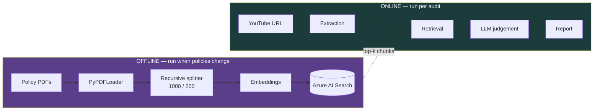
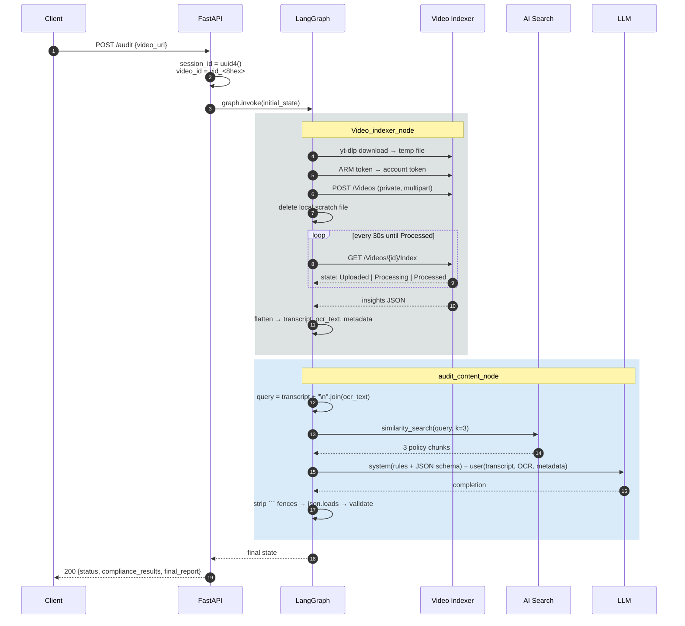
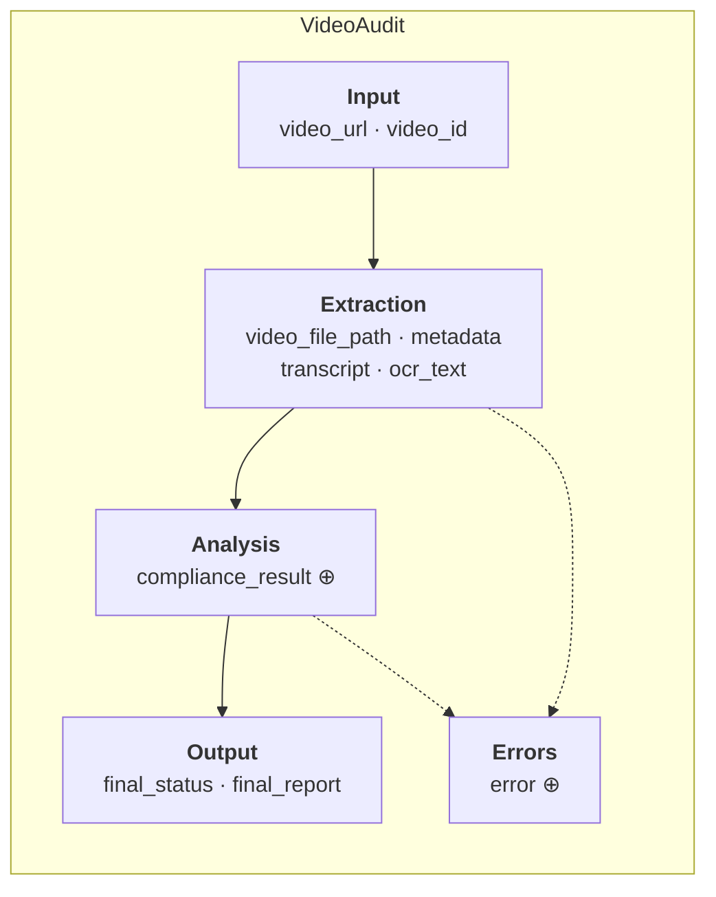
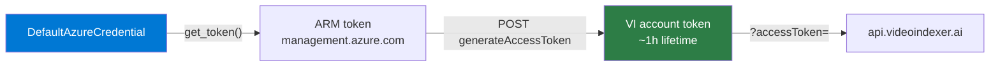
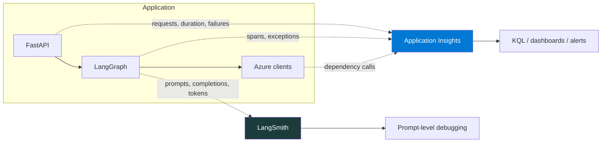

# Architecture

A deep dive into how AdAudit is put together, why it is shaped this way, and what each moving part is responsible for. For setup instructions see the [README](../README.md).

---

## Table of contents

- [Design goals](#design-goals)
- [The two pipelines](#the-two-pipelines)
- [Offline pipeline: building the policy index](#offline-pipeline-building-the-policy-index)
- [Online pipeline: auditing a video](#online-pipeline-auditing-a-video)
- [State design](#state-design)
- [Node contracts](#node-contracts)
- [The Video Indexer client](#the-video-indexer-client)
- [Retrieval and grounding](#retrieval-and-grounding)
- [Structured output and failure handling](#structured-output-and-failure-handling)
- [Observability design](#observability-design)
- [Design decisions and trade-offs](#design-decisions-and-trade-offs)
- [Extension points](#extension-points)

---

## Design goals

The system was built around four constraints, in priority order:

1. **Verdicts must be grounded.** A model asked "is this ad compliant?" from parametric memory will hallucinate rules and cite regulations that do not exist. Every verdict must be produced against retrieved policy text that a human can go read.
2. **Failure must be legible.** A compliance pipeline that silently returns `PASS` because an API call timed out is worse than no pipeline. Every failure path produces an explicit `FAIL` with a recorded reason.
3. **Output must be machine-consumable.** The point is to gate a publishing workflow, so the result is a typed record, not a paragraph.
4. **The pipeline must be extensible without rewrites.** New checks arrive constantly as platform policies change. Adding one should mean adding a node, not restructuring control flow.

Those constraints are what led to a state graph rather than a linear chain, and to accumulating reducers rather than plain assignment.

---

## The two pipelines

The system has an **offline** path that runs occasionally and an **online** path that runs per audit. They meet at the vector index.



Keeping them separate matters for cost and latency. Embedding a 200-page rulebook takes minutes and costs real money; doing it per request would be absurd. The online path pays only for one vector query.

---

## Offline pipeline: building the policy index

**Entry point:** `Backend/scripts/index_documents.py`

```
Backend/data/*.pdf
      │
      ├─ PyPDFLoader.load()                    → one Document per page
      │
      ├─ RecursiveCharacterTextSplitter        → chunk_size=1000, overlap=200
      │     splits on ["\n\n", "\n", " ", ""] in order
      │
      ├─ metadata["source"] = <filename>       → provenance for citations
      │
      ├─ text-embedding-3-small                → 1536-dim vector per chunk
      │
      └─ AzureSearch.add_documents()           → upsert into the index
```

### Why these chunking parameters

| Parameter | Value | Reasoning |
|-----------|-------|-----------|
| `chunk_size` | 1000 chars | Roughly one dense policy paragraph. Large enough to carry a complete rule and its qualifier; small enough that a top-3 retrieval fits comfortably in context alongside a full transcript. |
| `chunk_overlap` | 200 chars | Regulatory text depends heavily on the sentence before it ("...*provided that* the disclosure appears..."). Overlap keeps a rule from being severed from its condition at a chunk boundary. |
| Splitter | `Recursive` | Splits on paragraph breaks first, falling back to lines, then words. Preserves semantic units far better than a fixed-width split. |

### Why a separate embedding model

`text-embedding-3-small` at 1536 dimensions is the cost/quality sweet spot for this corpus. Policy documents are dense English prose with heavy domain vocabulary; the small model handles them well, and the corpus is a few hundred chunks, not millions, so the marginal recall from a larger model does not justify the cost.

---

## Online pipeline: auditing a video



### Timing profile

| Stage | Typical duration | Dominant cost |
|-------|-----------------|---------------|
| Download | 5–30s | Network, video length |
| Upload | 10–60s | Video file size |
| **Video Indexer processing** | **2–10 min** | **Indexing preset, video duration** |
| Vector search | < 1s | — |
| LLM inference | 5–20s | Transcript length, output tokens |

Video Indexer dominates by an order of magnitude, which is why the synchronous `/audit` endpoint is a known architectural weakness and an async job queue sits high on the roadmap.

---

## State design

**File:** `Backend/src/graph/state.py`

`VideoAudit` is a `TypedDict` that flows through every node. LangGraph merges each node's returned partial dict into it.



`⊕` marks fields with an `operator.add` reducer.

### Why reducers matter

Without a reducer, a node returning `{"error": ["upload failed"]}` **replaces** the error list, discarding whatever an earlier node recorded. With `Annotated[List[str], operator.add]`, LangGraph concatenates instead:

```python
compliance_result: Annotated[List[ComplianceIssue], operator.add]
error: Annotated[List[str], operator.add]
```

This is what makes it safe to add more checking nodes later. Each one contributes its findings to a shared list, and no node needs to know what the others found. It is also what makes fan-out possible: parallel checks can merge without a coordinator.

Plain fields (`transcript`, `final_status`) use last-write-wins, which is correct for them — a later node genuinely should be able to overwrite the status.

### `final_status` semantics

| Value | Meaning |
|-------|---------|
| `PASS` | The audit ran and found no violations |
| `FAIL` | Either violations were found **or** the pipeline could not complete |

Collapsing "violations found" and "audit broke" into one status is deliberate **fail-closed** design: any outcome other than a clean, verified pass must not let an ad through. The `error` list distinguishes the two cases for anyone who needs to know which happened.

---

## Node contracts

Every node obeys the same contract:

```python
def node(state: VideoAudit) -> Dict[str, Any]:
    """Reads what it needs from state; returns only the keys it changed."""
```

**Rules:**

1. **Return a partial dict, never a full state.** LangGraph merges. Returning everything defeats the reducers.
2. **Never raise past your own handler.** An escaping exception aborts the graph and throws away partial results from earlier nodes. Catch, log, and return `{"error": [...], "final_status": "FAIL"}`.
3. **Do not mutate `state` in place.** Treat it as read-only input.
4. **Keep transport out of the node.** Nodes call service methods; services own URLs, tokens, and retries.

### `Video_indexer_node`

| | |
|---|---|
| **Reads** | `video_url`, `video_id` |
| **Writes** | `transcript`, `ocr_text`, `metadata`, `error`, `final_status` on failure |
| **External** | Azure Video Indexer (via the `video_indexer` service) |
| **Guards** | Rejects any URL that is not a YouTube host |
| **Cleanup** | Deletes the scratch `.mp4` after upload |

### `audit_content_node`

| | |
|---|---|
| **Reads** | `transcript`, `ocr_text`, `metadata` |
| **Writes** | `compliance_result`, `final_status`, `final_report` |
| **External** | Azure AI Search, Azure AI Foundry chat model |
| **Guards** | Short-circuits to `FAIL` when the transcript is empty — no transcript means no evidence, and no evidence must not become a `PASS` |

---

## The Video Indexer client

**File:** `Backend/src/services/video_indexer.py`

### Token exchange

Azure Video Indexer does not accept an ARM token directly. Access is a two-step exchange:



`DefaultAzureCredential` resolves an identity from whatever is available, in order: environment variables, workload identity, managed identity, Azure CLI login, and so on. The practical result is that the same code runs locally against `az login` and in production against a managed identity, **with no Video Indexer secret stored anywhere**.

The account token is fetched fresh for each operation rather than cached. That is slightly wasteful but avoids expiry handling in the polling loop, where a run can outlive a token.

### Method responsibilities

| Method | Does |
|--------|------|
| `get_access_token()` | ARM token via `DefaultAzureCredential` |
| `get_account_token(arm_token)` | Exchanges the ARM token for a VI account token scoped to the account |
| `download_video(url, path)` | `yt-dlp` fetch, best MP4, quiet, to a fixed scratch path |
| `upload_video(video_id, path)` | Multipart POST to `/Videos` with `privacy=Private`, `indexingPreset=Default` |
| `wait_for_extract(video_id)` | Polls every 30s until `Processed`; raises on `Failed` or `Quarantined` |
| `clean_extract(raw)` | Flattens the insights JSON into `transcript`, `ocr_text`, `video_metadata` |

### Video Indexer states

| State | Handling |
|-------|----------|
| `Uploaded` / `Processing` | Keep polling |
| `Processed` | Return the insights payload |
| `Failed` | Raise — the service could not index the media |
| `Quarantined` | Raise — copyright or policy block on the content itself |

`Quarantined` is worth calling out: Video Indexer refuses to process content it flags, which for an ad-compliance tool is itself a meaningful signal about the asset.

---

## Retrieval and grounding

### Query construction

The retrieval query is the concatenation of everything the video says, in both channels:

```python
query_text = f"{transcript} {'\n'.join(ocr_text)}"
docs = vector_store.similarity_search(query_text, k=3)
```

Using the whole transcript as the query — rather than a distilled question — works because the embedding lands the ad near policy chunks that discuss the same *subject matter*. An ad full of health claims retrieves substantiation rules; an influencer ad retrieves disclosure rules. No query planning is needed for the common case.

**Where it breaks down:** a long ad touching several policy areas at once produces an averaged embedding that may match none of them strongly, and `k=3` is a hard ceiling on how many rules can be considered. Per-claim retrieval — extract claims first, retrieve for each — is the planned fix.

### Prompt structure

```
┌─ SYSTEM ──────────────────────────────────────┐
│ Role: video ad auditor                        │
│ ── retrieved policy chunks (k=3) ──           │
│ Instructions:                                 │
│   1. analyze transcript and OCR               │
│   2. identify violations                      │
│   3. return strictly this JSON schema         │
│ Empty findings ⇒ status = PASS                │
└───────────────────────────────────────────────┘
┌─ USER ────────────────────────────────────────┐
│ VIDEO METADATA: {...}                         │
│ TRANSCRIPT: "..."                             │
│ ON-SCREEN TEXT (OCR): [...]                   │
└───────────────────────────────────────────────┘
```

The policy text goes in the **system** message, the evidence in the **user** message. That separation matters: it frames the rules as the model's operating instructions and the ad as the material under examination, which measurably reduces the model treating claims in the ad as authoritative.

`temperature=0.0` — the same ad must produce the same verdict. A compliance tool that returns different answers on reruns cannot be used as a gate.

---

## Structured output and failure handling

The model is asked for exactly this shape:

```json
{
  "compliance_results": [
    { "category": "...", "severity": "...", "description": "..." }
  ],
  "status": "PASS | FAIL",
  "final_report": "..."
}
```

### Parsing defence

Chat models wrap JSON in markdown fences even when told not to, so the completion is cleaned before parsing:

```python
content = response.content
if "```" in content:
    content = re.search(r"```(?:json)?(.*?)```", content, re.DOTALL).group(1)
audit_data = json.loads(content.strip())
```

Anything that still fails to parse lands in the `except` branch and returns `FAIL` with an explanatory report. **Unparseable output is never a pass.**

> **Planned improvement:** replace fence-stripping with LangChain's `with_structured_output()`, which uses the provider's native constrained-decoding support and removes this class of failure entirely. Tracked for v0.3.

### Failure matrix

| Failure | Detected in | Result |
|---------|-------------|--------|
| Non-YouTube URL | `Video_indexer_node` | `FAIL`, error recorded, no Azure spend |
| Download failure | `download_video` | `FAIL` with the `yt-dlp` reason |
| Upload rejected | `upload_video` | `FAIL` with the HTTP status and body |
| VI reports `Failed` | `wait_for_extract` | `FAIL` — media could not be indexed |
| VI reports `Quarantined` | `wait_for_extract` | `FAIL` — copyright or policy block |
| Empty transcript | `audit_content_node` | `FAIL` — no evidence is not a pass |
| Search unreachable | `audit_content_node` | `FAIL` — ungrounded judgement is refused |
| LLM error or bad JSON | `audit_content_node` | `FAIL` with the parse error |

Every row ends in `FAIL`. That is the design.

---

## Observability design



### Why telemetry is configured first

In `server.py`, `setup_telemetry()` is called **before** the graph module is imported:

```python
from Backend.src.api.telemetry import setup_telemetry
setup_telemetry()

from Backend.src.graph.workflow import graph
```

OpenTelemetry instruments libraries by patching them at import time. Configuring the exporter after LangChain and `requests` are already imported means those calls are never instrumented. The import order here is load-bearing, not stylistic — do not let an import sorter rearrange it.

### The two tools answer different questions

| Question | Tool |
|----------|------|
| How many audits ran today, and how many failed? | Application Insights |
| Which stage is the P95 latency in? | Application Insights |
| Why did *this* ad get flagged? | LangSmith |
| Which policy chunks were retrieved for it? | LangSmith |
| What did the model actually return before parsing? | LangSmith |

`session_id` (UUID4) is generated per request, returned to the client, and embedded in `video_id`, which is what lets a user-reported "this verdict is wrong" be traced back to the exact run.

---

## Design decisions and trade-offs

### Graph over chain

A linear chain would work today — there are only two nodes. The graph is chosen for what comes next: conditional edges (skip the audit when extraction is empty), parallel checks (brand safety and legal compliance evaluated concurrently, merged by reducers), and human-in-the-loop interrupts. Each of those is a rewrite in a chain and an addition in a graph.

### Video Indexer over a self-hosted stack

Whisper plus a self-hosted OCR model would be cheaper per video and avoid a vendor dependency. Video Indexer was chosen for operational reasons: one API returns transcript, OCR, scene boundaries, and object labels together, with no GPU to manage and no frame-sampling pipeline to write. The cost is a hard dependency on Azure and multi-minute latency.

### Synchronous API

`POST /audit` blocking for minutes is the clearest known weakness. It exists because a synchronous endpoint was the fastest path to something demonstrable. The replacement — `202 Accepted` plus a job id, a status endpoint, and optional webhooks — is scoped for v0.4.

### Fixed `k=3`

Three chunks keeps the prompt small and cheap, and works well for single-issue ads. It under-retrieves on long, multi-claim creatives. Adaptive-`k` or per-claim retrieval is the planned successor.

### `PASS`/`FAIL` rather than a score

A confidence score invites a threshold argument and gives false precision about a judgement the model cannot calibrate. A binary status plus severity-tagged findings makes the tool's actual role clear: it produces a *list of things to look at*, and a human decides.

---

## Extension points

| I want to... | Do this |
|--------------|---------|
| Add a compliance check | Add a node in `nodes.py`, wire it in `workflow.py`, return findings into `compliance_result` |
| Support another platform's rules | Drop the policy PDF in `Backend/data/`, re-run the indexer |
| Support another video source | Add a service class in `services/`, branch on the URL in `Video_indexer_node` |
| Skip the audit when extraction fails | Replace the fixed edge with `add_conditional_edges` on a transcript check |
| Add human review | Compile the graph with a checkpointer and an `interrupt_before` on the final node |
| Change the verdict format | Update the JSON schema in the system prompt, `ComplianceIssue` in `state.py`, and the Pydantic response model in `server.py` — all three, or the contract breaks |
| Run checks in parallel | Add edges from one node to several; the `operator.add` reducers merge the results for you |

---

## Related documents

- [README](../README.md) — setup, usage, API reference, development conventions
- [SECURITY](SECURITY.md) — credential handling and hardening checklist
- [CHANGELOG](../CHANGELOG.md) — what shipped when
- `nodes.drawio` — editable source of the architecture diagram
